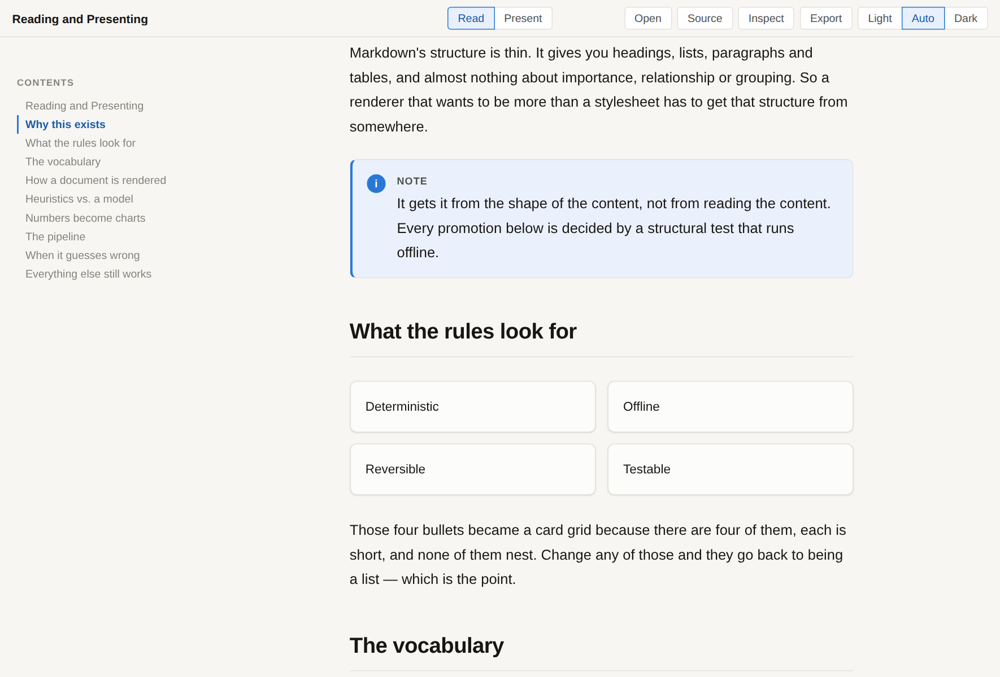
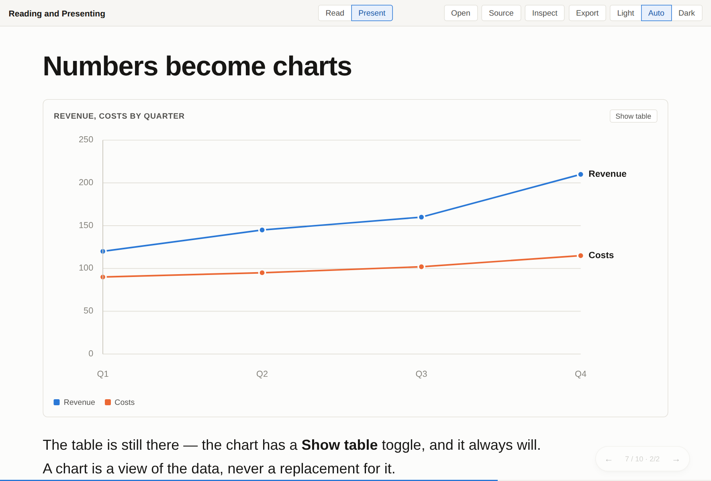

# markdown-renderer

[](https://github.com/wizdown/markdown-renderer/actions/workflows/ci.yml)
[](LICENSE)
[](#status)

Render an ordinary markdown file as a rich reading document — and, on a
keypress, as a presentation. Same file, same tree, no slide markers and no
special authoring format.

Nothing in the required path uses an LLM. Parsing, inference, rendering and
export are deterministic and run offline with no API key.



Press <kbd>P</kbd> and the same document becomes a deck:



## Quick start

Requires **Node 20+**.

```bash
git clone https://github.com/wizdown/markdown-renderer.git
cd markdown-renderer
npm install
npm run dev          # http://localhost:5173
```

The app opens with a sample document. Use **Open** to load your own markdown,
**Present** (or <kbd>P</kbd>) to switch views, and **Export** to save the
result as a single HTML file.

## Export from the command line

```bash
npm run build:cli
node dist-cli/mdr.mjs talk.md              # -> talk.html
node dist-cli/mdr.mjs talk.md -o out.html  # choose the output path
node dist-cli/mdr.mjs talk.md --stdout     # pipe it somewhere
node dist-cli/mdr.mjs talk.md --diagrams   # inline the mermaid runtime
```

Run `npm link` in the clone to get `mdr` on your `PATH`. The package is not on
npm yet, so there is no `npx` route.

Either way the artifact is **one HTML file**. Markup, styles, highlighted code,
maths fonts and both views are inlined, along with a small script to switch
between them — no server, no network, no install. It opens from a filesystem,
offline, on any machine.

The CLI cannot draw mermaid diagrams (that needs a browser layout engine), so
it either shows them as source (~430 KB) or inlines the mermaid runtime with
`--diagrams` (~3.9 MB). The app's **Export** pre-renders them to SVG instead
(~500 KB). See [docs/design.md](docs/design.md#exporting) for why.

## What it promotes

Markdown gives you headings, lists, paragraphs and tables, and almost nothing
about importance, relationship or grouping. This renderer recovers that from
the *shape* of the content — item count, item length, nesting depth, how many
table cells parse as numbers — never from reading it for meaning.

| Signal | Becomes |
| --- | --- |
| Blockquote opening `> [!NOTE]` or `> **Note:**` | callout |
| Unordered list, 2+ items, all `**Term** — description` | definition cards |
| Unordered list, 3–6 short flat items | card grid |
| Ordered list, 3+ items of uniform shape | numbered stepper |
| Table with a label column and 1–6 numeric columns sharing a unit | chart (+ table toggle) |
| 2–3 consecutive **sub**-sections whose bodies are each one list | side-by-side columns |
| Unordered list nested 3+ levels deep | collapsible outline |

Every rule is refusable, and refusing is the common case: charts refuse mixed
units, task lists are never collapsed, ordinary quotations stay quotations.
[docs/design.md](docs/design.md#deliberate-refusals) covers the refusals and
the reasoning behind them.

## When it guesses wrong

Turn on **Inspect**. Every promoted block wears a chip naming the rule that
produced it, and the menu writes your correction back into the markdown as one
line:

```md
<!-- render: prose -->
- This list is pinned
- and will stay a list
```

Delete the line and the rules take over again. `prose` pins a block to its
plain rendering; any rule name forces that rule with its gates disabled. The
correction lives in the document, so it survives a reload, a re-render, and
being sent to someone else.

Container directives work too, for authoring rather than correcting:

```md
:::cards{columns=2}
- Explicitly requested
- Two columns
:::
```

## Keyboard

| Key | Action |
| --- | --- |
| <kbd>P</kbd> | Toggle reading ⇄ presenting |
| <kbd>→</kbd> <kbd>Space</kbd> | Next reveal step, then next panel |
| <kbd>←</kbd> | Previous |
| <kbd>↑</kbd> <kbd>↓</kbd> | Previous / next panel, skipping reveals |
| <kbd>F</kbd> | Fullscreen |
| <kbd>Esc</kbd> | Back to reading |

## Supported markdown

CommonMark and GFM (tables, task lists, strikethrough, autolinks, footnotes),
plus YAML/TOML frontmatter, `$math$` via KaTeX, `` ```mermaid `` diagrams,
container directives, reference links and images, code-fence metadata
(`` ```ts title="a.ts" {2-4} ``), and raw HTML through a strict allowlist
sanitizer.

That is a test-suite claim rather than an architecture claim —
[`fixtures/kitchen-sink.md`](fixtures/kitchen-sink.md) is the claim and
[`test/conformance.test.ts`](test/conformance.test.ts) checks it.

## Project layout

```
src/core/      parse → sections → rules → IR      (no React, no DOM, no network)
src/render/    IR → React                          (doc, deck, every block kind)
src/export/    IR → one self-contained .html       (browser and Node paths)
src/cli.ts     the `mdr` command
src/ui/        toolbar, TOC, theme
fixtures/      kitchen-sink.md, sample.md
test/          conformance, rules, overrides, deck, sanitizer
```

## Scripts

```bash
npm run dev        # dev server
npm test           # vitest
npm run typecheck  # tsc --noEmit
npm run build      # typecheck, then app and CLI
npm run build:cli  # just the CLI
```

## Documentation

[docs/design.md](docs/design.md) — the Presentation IR, why inference is
structural rather than semantic, what the rules refuse and why, and how the
two export paths stay in sync.

## Status

**This is beta.** It works and it is tested, but the rule set, the IR and the
override syntax are all still moving, and releases before 1.0 may break them.

Pull requests are **not being accepted yet** — the internals change too often
for outside patches to be fair to anyone. That is a temporary policy and will
be revisited as things settle; see [CONTRIBUTING.md](CONTRIBUTING.md). Bug
reports are genuinely welcome in the meantime, through
[issues](https://github.com/wizdown/markdown-renderer/issues).

Forks are welcome and always will be.

## License

[MIT](LICENSE) © Abhishek Gupta
