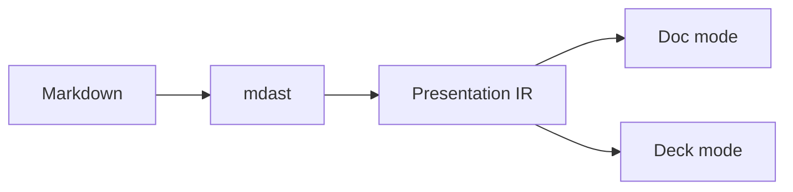

# Kitchen Sink

Every markdown construct this renderer claims to support, in one file. If a
change breaks something, it should break here first.

This paragraph has *emphasis*, **strong**, ***both***, ~~strikethrough~~,
`inline code`, a [link](https://example.com), a [titled link](https://example.com "Hover"),
an <https://example.com/autolink>, a footnote[^1], an entity &amp; and a
hard break at the end of this line  
which continues here.

[^1]: Footnotes hold **block content**, including more than one paragraph.

    Like this second one.

## Headings

# H1
## H2
### H3
#### H4
##### H5
###### H6

Setext H1
=========

Setext H2
---------

## Lists

### Tight unordered

- First
- Second
- Third

### Loose unordered

- First item, which is long enough that it will not be mistaken for a card in a
  grid because it runs well past the length gate the rule applies.

- Second item, also long, also prose, also staying exactly where it is.

### Ordered with a custom start

5. Five
6. Six
7. Seven

### Task list

- [x] Completed task
- [ ] Incomplete task
- [ ] Another one

### Deeply nested

- Level one
  - Level two
    - Level three
      - Level four
  - Back to two
- Level one again

## Code

Indented code block:

    plain indented code
    second line

Fenced, no language:

```
no language here
```

Fenced with language, title and highlighted lines:

```ts title="pipeline.ts" {2-3}
export function render(source: string) {
  const ir = renderToIR(source)
  return draw(ir)
}
```

## Tables

| Left | Center | Right |
| :--- | :----: | ----: |
| a    | b      | c     |
| longer cell | x | 42 |

A ragged table, which must still render as a rectangle:

| One | Two | Three |
| --- | --- | --- |
| only one |
| a | b | c | d |

## Block quotes

> A plain quotation, which must stay a quotation and not grow a warning icon.
>
> — Someone

> Nested:
> > one level down
> > > two levels down

## Horizontal rules

---

***

___

## Raw HTML

<div class="callout">
  <strong>Raw HTML</strong> passes through the allowlist sanitizer.
</div>

<script>alert('this must not survive')</script>

<a href="javascript:alert(1)">unsafe link</a>
<a href="https://example.com" target="_blank">safe link</a>

## Images


## Reference links

[reference link][ref], [collapsed][], and ![a referenced image][img].

An [undefined reference][nope] renders as its literal source.

[ref]: https://example.com "Reference title"
[collapsed]: https://example.com/collapsed
[img]: https://placehold.co/400x120/png

## Math

Inline math: $E = mc^2$ sits in the sentence.

Display math:

$$
\int_{0}^{\infty} e^{-x^2}\,dx = \frac{\sqrt{\pi}}{2}
$$

## Mermaid



## Promotions

These are the blocks the rules pick up. Each one must also survive being
pinned back to prose.

### Cards

- Deterministic
- Offline
- Reversible
- Testable

### Definitions

- **mdast** — the markdown syntax tree remark produces
- **Presentation IR** — what every renderer actually consumes
- **Rule** — a structural test that promotes one shape into another

### Stepper

1. Parse the markdown into mdast
2. Nest headings into sections
3. Run the structural rules over each sibling list
4. Render the resulting IR

### Chart

| Quarter | Revenue | Costs |
| ------- | ------: | ----: |
| Q1 | 120 | 90 |
| Q2 | 145 | 95 |
| Q3 | 160 | 102 |
| Q4 | 210 | 115 |

### Callouts

> [!NOTE]
> GitHub alert syntax.

> [!WARNING]
> This one is a warning.

> **Tip:** the bold-label style works too.

### Comparison

#### Heuristics

- Deterministic
- Free to run
- Needs no key

#### A model

- Reads meaning
- Costs per render
- Needs a network

## Explicit annotations

<!-- render: prose -->
- This list is pinned to prose
- Even though it would otherwise
- Be promoted to cards

:::cards{columns=2}
- Explicitly requested
- Two columns
:::

<!-- render: chart variant=line -->

| Month | Signups |
| ----- | ------: |
| Jan | 120 |
| Feb | 180 |
| Mar | 240 |

## Edge cases

An empty list item:

-
- After an empty one

A paragraph immediately followed by a list with no blank line:
- item one
- item two

Escaped characters: \*not emphasis\*, \# not a heading, \[not a link\].

A line with trailing whitespace and a backslash break\
continues here.

Unicode: 日本語, emoji 🎯, and combining marks é.
