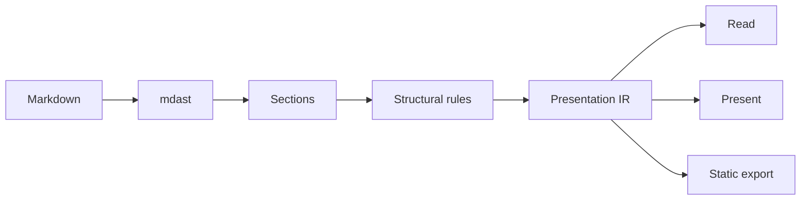

# Reading and Presenting

This is ordinary markdown. No slide markers, no special syntax, no front-matter
gymnastics — just a document. Press **P** to present it, and press **P** again
to go back to reading it.

## Why this exists

Markdown's structure is thin. It gives you headings, lists, paragraphs and
tables, and almost nothing about importance, relationship or grouping. So a
renderer that wants to be more than a stylesheet has to get that structure from
somewhere.

> [!NOTE]
> It gets it from the shape of the content, not from reading the content. Every
> promotion below is decided by a structural test that runs offline.

## What the rules look for

- Deterministic
- Offline
- Reversible
- Testable

Those four bullets became a card grid because there are four of them, each is
short, and none of them nest. Change any of those and they go back to being a
list — which is the point.

## The vocabulary

- **mdast** — the markdown syntax tree that remark produces
- **Presentation IR** — the tree every renderer actually consumes
- **Rule** — a structural test that promotes one shape into another
- **Panel** — one screen of the deck, projected from the same IR

## How a document is rendered

1. Parse the markdown into mdast, with no plugin that needs a network
2. Nest headings into sections, so structure is derived once
3. Run the structural rules over each list of siblings
4. Render the resulting IR as a document, a deck, or a static file

## Heuristics vs. a model

### Heuristics

- Deterministic
- Free to run
- Needs no key

### A model

- Reads meaning
- Costs per render
- Needs a network

## Numbers become charts

| Quarter | Revenue | Costs |
| ------- | ------: | ----: |
| Q1 | 120 | 90 |
| Q2 | 145 | 95 |
| Q3 | 160 | 102 |
| Q4 | 210 | 115 |

The table is still there — the chart has a **Show table** toggle, and it always
will. A chart is a view of the data, never a replacement for it.

## The pipeline



## When it guesses wrong

Turn on **Inspect** and every promoted block wears a chip naming the rule that
made it. The menu writes your correction back into the markdown as a single
comment line:

```md title="what gets written"
<!-- render: prose -->
- This list is pinned
- and will stay a list
```

Delete that line and the rules take over again. The correction lives in the
document, so it survives a reload, a re-render, and being sent to someone else.

## Everything else still works

Inline `code`, *emphasis*, **strong**, ~~strikethrough~~, [links](https://example.com),
footnotes[^1], and math like $e^{i\pi} + 1 = 0$.

[^1]: Which collect at the end of the document, where footnotes belong.

$$
\sum_{k=1}^{n} k = \frac{n(n+1)}{2}
$$
